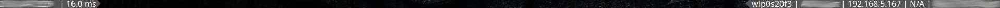
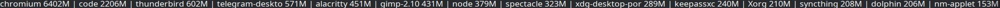
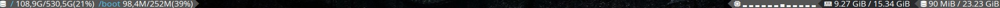

# Polybar

## Dependencies
- Font Awesome
- redshift
- brightnessctl
- pulseaudio
- alacritty
- playerctl

## Main

### audio (speaker/microphone)
leftclick to toogle 
scrolling to increase/decrease volume

### audioplayer
the audioplayer module is only active when there is an active audio player 
the audioplayer uses playerctl to detect and interact with audios 
the buttons act according to their appreance 
left click on the text pauses 
right click skips to the next track 
middle click goes to the previous track

*playerctl isn't exactly precice when picking the correct audio player so having more than one might lead to issues 
yes this includes browser*

### battery 
left click on module to open tinybar in battery mode

### brightness
left click to redshift 
middle click to blue shift 
right click to normalize 
scrolling to increase/decrease brightness

### cpu
left click on module to open tinybar in cpu mode 
right click on module to open tinybar in top mode 
middle click to open htop sorted by cpu

### network
left click on module to open tinybar in the according network mode

### ram
left click on module to open tinybar in ram mode 
right click on module to open tinybar in top mode  
middle click to open htop sorted by ram 

### worskapces
left click on Monitor to trigger the monitor setup script from bspwm (useful when connecting to another monitor) 
right click on Monitor to kill polybar and run the start script again (useful when connecting to another monitor) 
left click on desktop to switch to desktop

## Tinybar
Tinybar is a helper bar to act as a temporary bar below the main bar providing data that wouldn't fit otherwise

right click will always close the bar
trying to open the already open bar will close it as well

### battery

### cpu

### network

left click on any iformation copies the information to the clipoard

### ram

### top

middle click on a directory to open it in flielight

